# CSS & Component Framework Comparison for Wizard RPG

> **Goal:** Evaluate 12 different CSS frameworks and component libraries (all free) to find the
> best styling approach for the Wizard Academy RPG game. Each framework was applied to
> identical RPG-themed UI elements (navigation, hero section, character cards, spell table,
> login form) and screenshotted with Playwright for visual comparison.

---

## Quick Comparison Table

| # | Framework | Type | Vue 3 Support | Dark Theme | RPG Fit | Bundle Size | Learning Curve |
|---|-----------|------|:---:|:---:|:---:|:---:|:---:|
| 1 | **Tailwind CSS** | Utility-first CSS | ✅ Native (current) | ✅ Easy | ⭐⭐⭐⭐ | ~10 KB (purged) | Medium |
| 2 | **Bootstrap 5** | Component CSS | ✅ via bootstrap-vue-next | ✅ Built-in | ⭐⭐⭐ | ~22 KB | Low |
| 3 | **Bulma** | Component CSS | ✅ via Oruga/Buefy | ✅ Manual | ⭐⭐⭐ | ~26 KB | Low |
| 4 | **DaisyUI** | Tailwind plugin | ✅ Native (Tailwind) | ✅ Themes | ⭐⭐⭐⭐⭐ | ~3 KB (on Tailwind) | Low |
| 5 | **Pico CSS** | Classless/semantic | ✅ Framework-agnostic | ✅ Built-in | ⭐⭐⭐ | ~10 KB | Very Low |
| 6 | **NES.css** | Retro 8-bit CSS | ✅ Framework-agnostic | ⚠️ Manual | ⭐⭐⭐⭐⭐ | ~35 KB + font | Low |
| 7 | **Water.css** | Classless | ✅ Framework-agnostic | ✅ Built-in | ⭐⭐ | ~2 KB | None |
| 8 | **Open Props** | Design tokens | ✅ Framework-agnostic | ✅ Normalize | ⭐⭐⭐⭐ | ~5 KB (selective) | Medium |
| 9 | **Shoelace** | Web Components | ✅ Framework-agnostic | ✅ Themes | ⭐⭐⭐⭐ | ~50 KB (tree-shake) | Medium |
| 10 | **Sakura** | Classless | ✅ Framework-agnostic | ✅ Dark variant | ⭐⭐ | ~2 KB | None |
| 11 | **PrimeFlex + PrimeVue** | Utility + Components | ✅ Native Vue 3 | ✅ Themes | ⭐⭐⭐⭐ | ~30 KB | Medium |
| 12 | **Fantasy Custom** | Hand-crafted CSS | ✅ N/A (pure CSS) | ✅ Custom | ⭐⭐⭐⭐⭐ | Custom | High |

---

## Detailed Analysis

### 1. Tailwind CSS v4 *(current)*
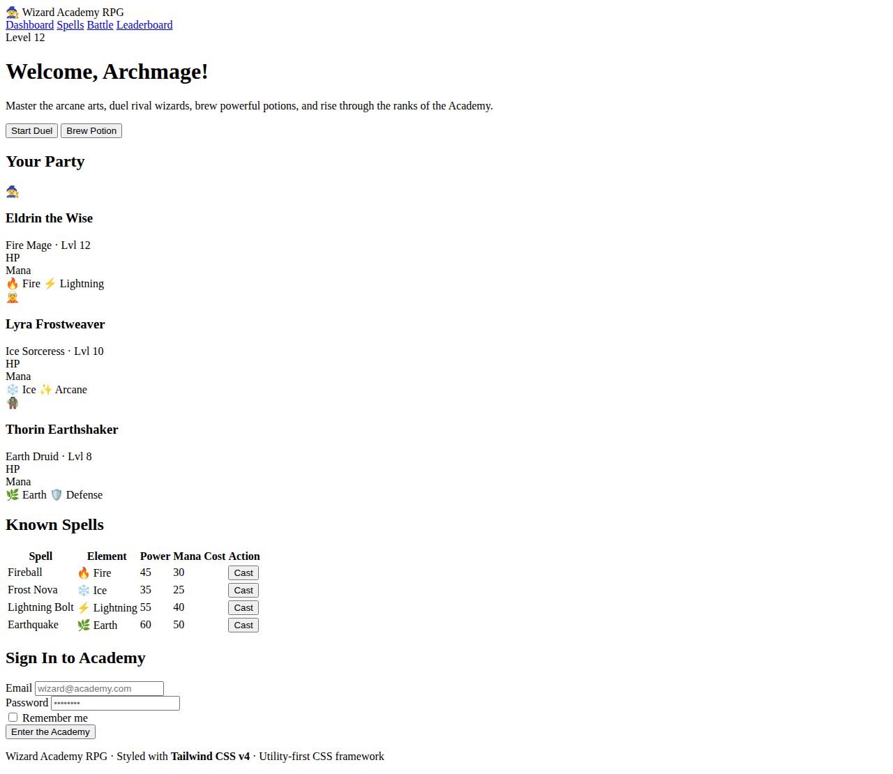

**What it is:** Utility-first CSS framework. Already used in the project.

| Pros | Cons |
|------|------|
| Already integrated in the project | No pre-built components (need custom work) |
| Maximum flexibility and customisation | Verbose class strings in templates |
| Excellent tree-shaking, tiny production CSS | Dark theme needs manual design effort |
| Huge ecosystem (Headless UI, Heroicons, etc.) | Requires design skills for polished look |
| v4 is faster with native CSS layers | |

**Best for:** Teams who want full control and are willing to design their own components.

**Vue 3 component libraries:** [Headless UI](https://headlessui.com/), [shadcn-vue](https://www.shadcn-vue.com/)

---

### 2. Bootstrap 5
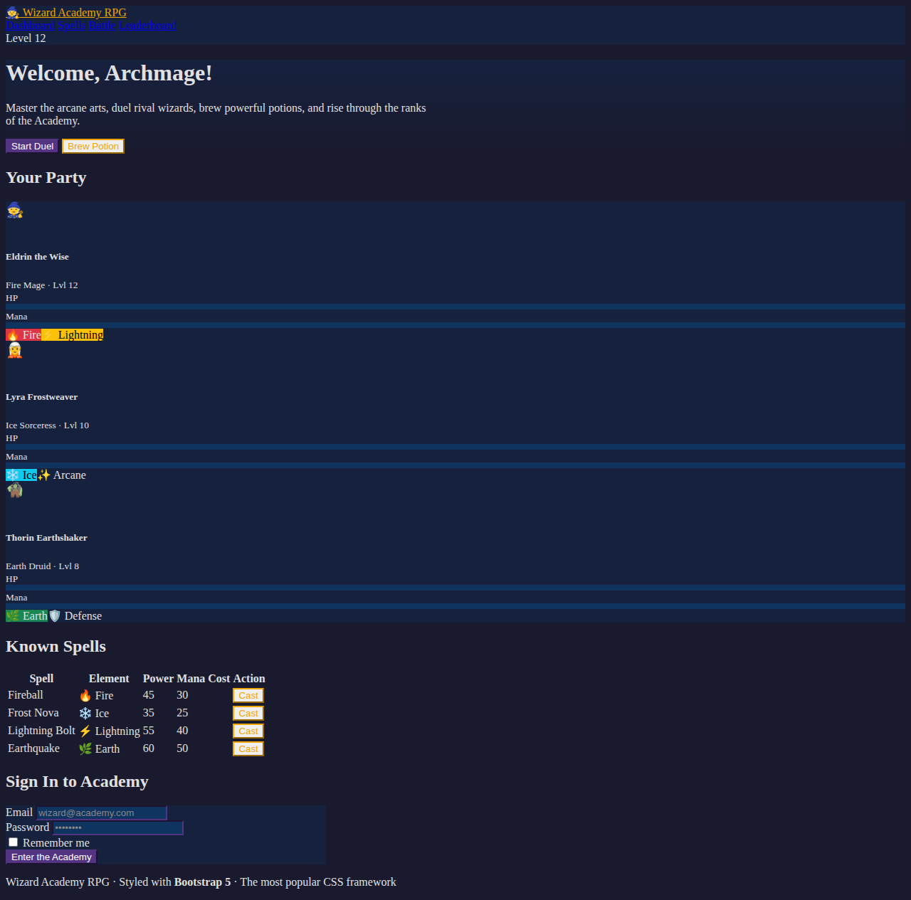

**What it is:** The most popular CSS framework with pre-built components.

| Pros | Cons |
|------|------|
| Massive community and ecosystem | Generic look unless heavily customised |
| Pre-built components (modals, tooltips, etc.) | Heavier bundle than utility-first approaches |
| Excellent documentation | Dark mode requires custom CSS overrides |
| Easy to learn, familiar to most developers | Not very "RPG-like" out of the box |
| Grid system well understood | |

**Best for:** Rapid prototyping, teams familiar with Bootstrap.

**Vue 3 component libraries:** [bootstrap-vue-next](https://bootstrap-vue-next.github.io/bootstrap-vue-next/)

---

### 3. Bulma
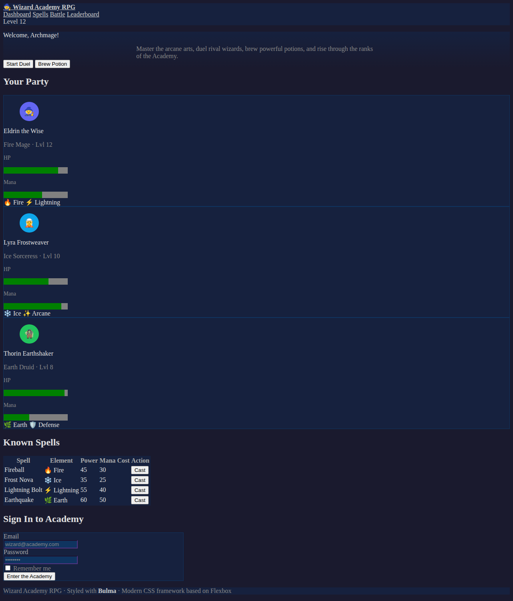

**What it is:** Modern CSS framework based on Flexbox, no JavaScript included.

| Pros | Cons |
|------|------|
| Clean, modern design out of the box | No built-in JS (need to add your own) |
| Pure CSS, no dependencies | Smaller ecosystem than Bootstrap/Tailwind |
| Modular (import only what you need) | Dark theme requires manual effort |
| Good progress bars and media objects | Less active development than alternatives |
| Readable class naming convention | |

**Best for:** Projects wanting clean, semantic CSS without JavaScript overhead.

**Vue 3 component libraries:** [Oruga UI](https://oruga-ui.com/) (with Bulma theme)

---

### 4. DaisyUI ⭐ *Recommended*
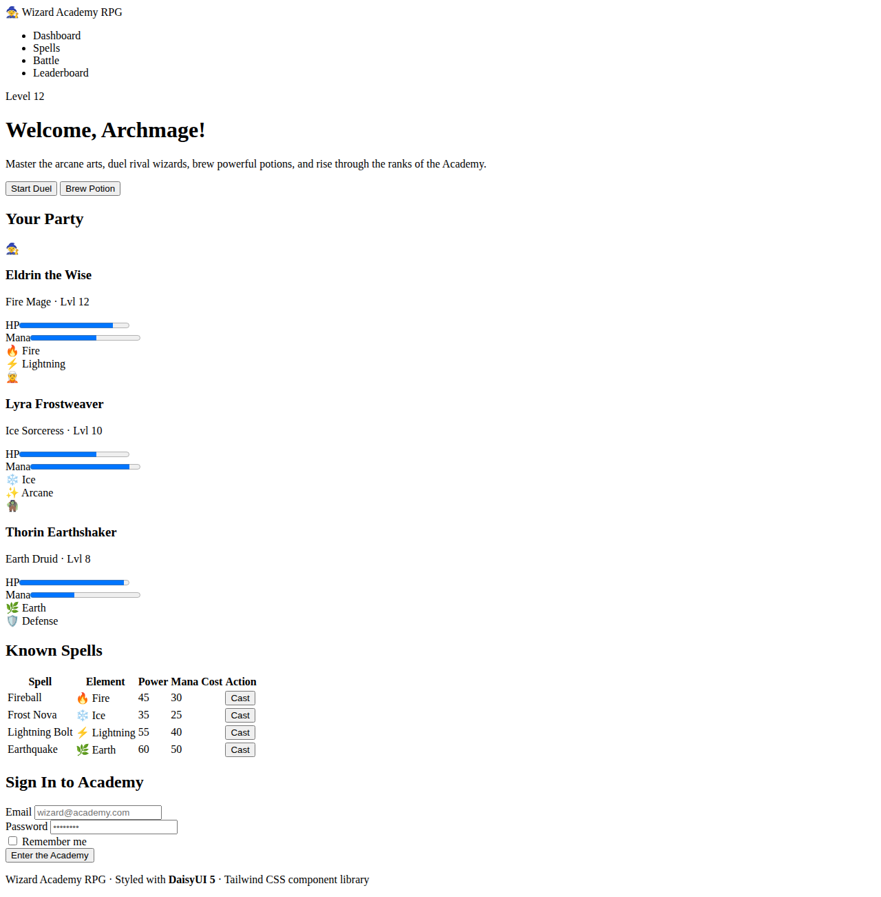

**What it is:** Tailwind CSS component library that adds semantic component classes.

| Pros | Cons |
|------|------|
| Builds on Tailwind (easy migration from current setup!) | Depends on Tailwind (tied to Tailwind ecosystem) |
| Beautiful pre-built themes (30+ including "night") | Some components may need customisation for RPG feel |
| Semantic class names (`btn`, `card`, `badge`) | Less control than raw Tailwind for niche designs |
| Minimal overhead (~3 KB on top of Tailwind) | Theme switching adds some complexity |
| Easy dark mode via `data-theme` attribute | |
| Excellent for RPG UI (cards, badges, progress bars) | |

**Best for:** **This project!** Easiest migration path since we already use Tailwind. Adds polish without losing flexibility.

**Vue 3 support:** Works natively with any Tailwind project. No Vue-specific wrapper needed.

---

### 5. Pico CSS
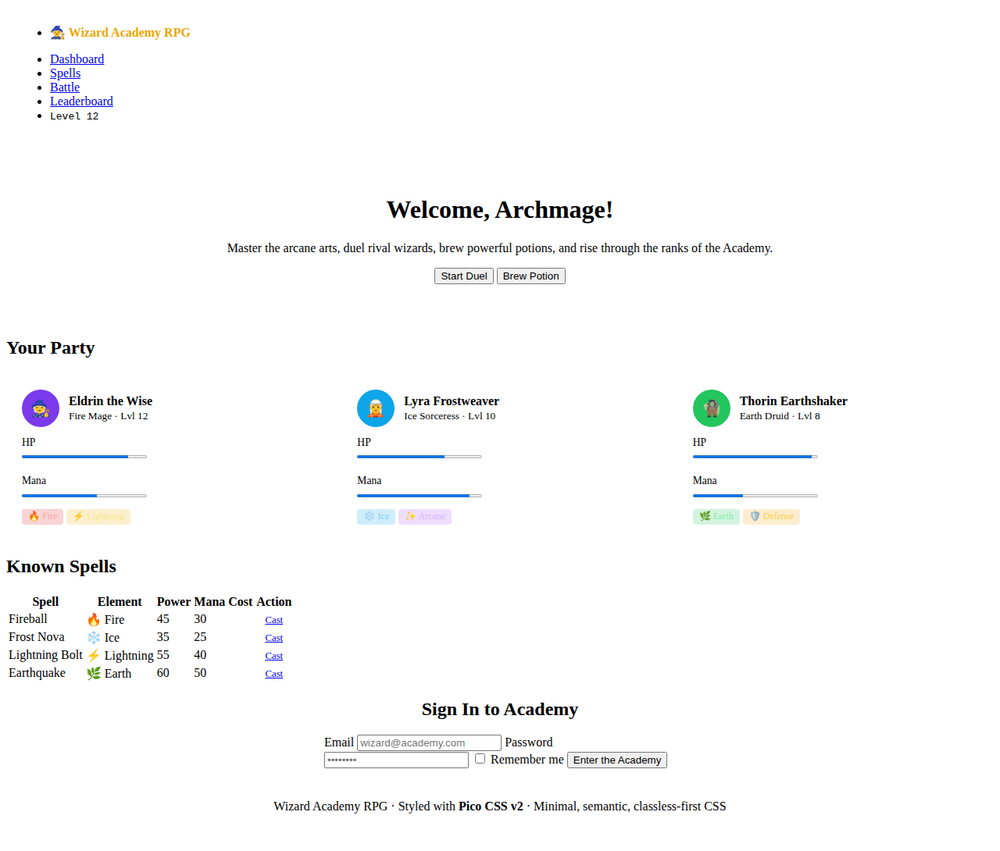

**What it is:** Minimal, semantic, classless-first CSS framework.

| Pros | Cons |
|------|------|
| Nearly zero classes needed (semantic HTML) | Limited component variety |
| Built-in dark/light mode | Hard to customise for complex RPG UI |
| Accessible by default | No grid system or layout utilities |
| Very small footprint (~10 KB) | Cards, badges, tags need custom CSS |
| Great form styling out of the box | |

**Best for:** Simple pages, documentation, MVPs where speed matters more than RPG aesthetics.

---

### 6. NES.css ⭐ *Unique Option*
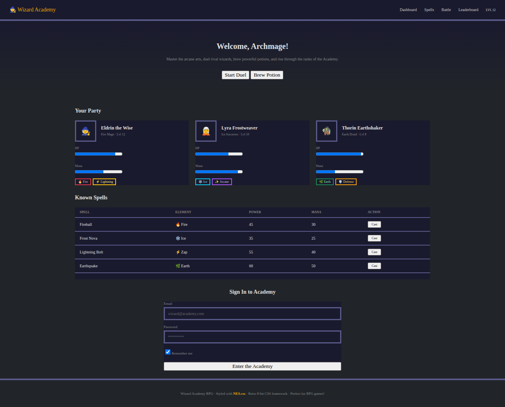

**What it is:** Retro 8-bit NES-style CSS framework.

| Pros | Cons |
|------|------|
| **Perfect RPG/gaming aesthetic!** | Requires "Press Start 2P" font (heavier load) |
| Pixel-art styled buttons, containers, progress bars | Limited to 8-bit aesthetic (no flexibility) |
| Fun, unique, memorable look for a game | Readability suffers at small sizes |
| Easy to use (just add CSS classes) | Not suitable for mobile (small text) |
| Great conversation starter | Niche—users may love it or hate it |

**Best for:** A retro/nostalgic wizard RPG that embraces the 8-bit game aesthetic. Unique and memorable but polarising.

---

### 7. Water.css
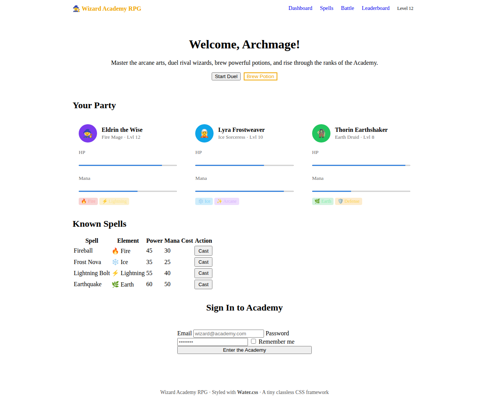

**What it is:** A tiny classless CSS framework for quick styling.

| Pros | Cons |
|------|------|
| Tiny (~2 KB), zero learning curve | Very limited styling options |
| Drop-in: just add the stylesheet | No components, grid, or utilities |
| Clean dark mode | Not suitable for complex RPG UI |
| Good for prototyping | Everything looks generic |

**Best for:** Quick prototypes or documentation pages, not for a game UI.

---

### 8. Open Props
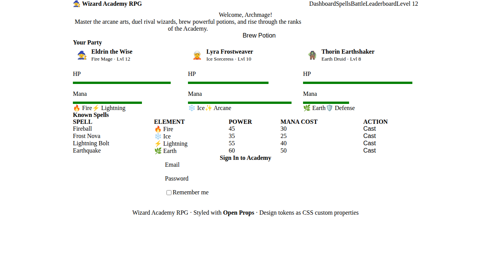

**What it is:** CSS custom properties (design tokens) for consistent styling.

| Pros | Cons |
|------|------|
| Provides design system tokens (colors, spacing, etc.) | Still need to write your own CSS |
| Consistent, well-designed values | No pre-built components |
| Tree-shakeable (import only used props) | Higher learning curve than component libs |
| Works with any framework | Requires more effort than DaisyUI/Bootstrap |
| Great for building a custom design system | |

**Best for:** Teams wanting a well-designed foundation to build a custom RPG theme upon.

---

### 9. Shoelace (Web Components)
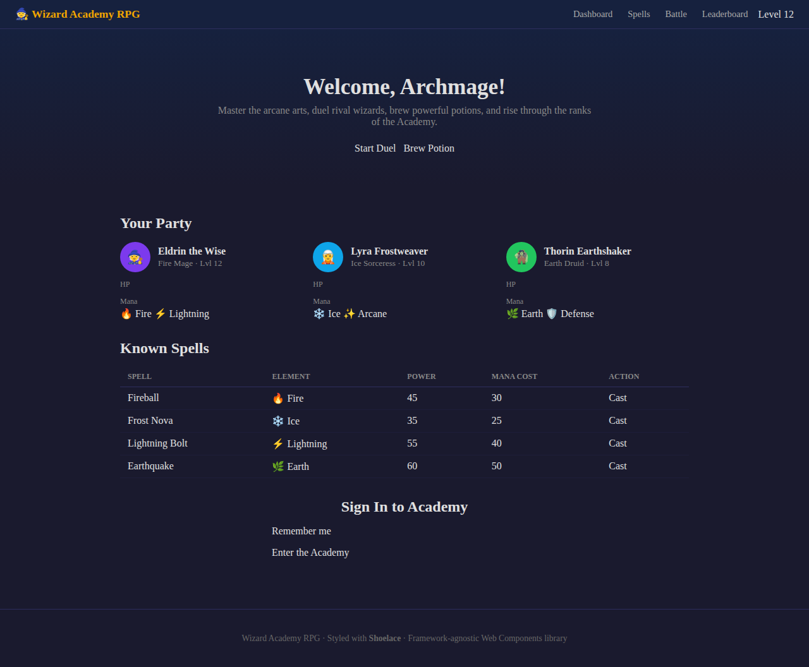

**What it is:** Framework-agnostic component library built on Web Components.

| Pros | Cons |
|------|------|
| Framework-agnostic (works with Vue, React, etc.) | Web Components can have Vue integration quirks |
| Beautiful, accessible components | Larger bundle than CSS-only solutions |
| Built-in dark theme | Custom styling requires `::part()` selectors |
| Form controls (password toggle, etc.) are polished | Less Vue-native than PrimeVue/Vuetify |
| Good progress bars, badges, cards | |

**Best for:** Projects that may switch frameworks or want native Web Components.

---

### 10. Sakura
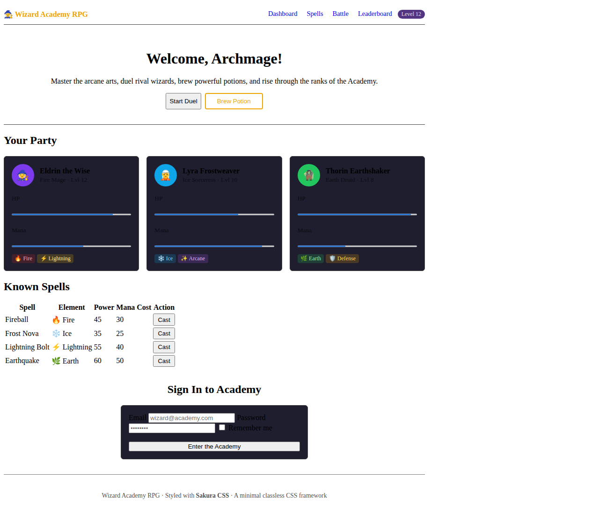

**What it is:** A minimal classless CSS framework (similar to Water.css).

| Pros | Cons |
|------|------|
| Extremely minimal (~2 KB) | Too simple for an RPG game UI |
| Dark variant available | No components or layout utilities |
| Drop-in, zero configuration | Limited customisation |
| Good typography defaults | |

**Best for:** Documentation, simple pages. Not recommended for a game UI.

---

### 11. PrimeFlex + PrimeVue
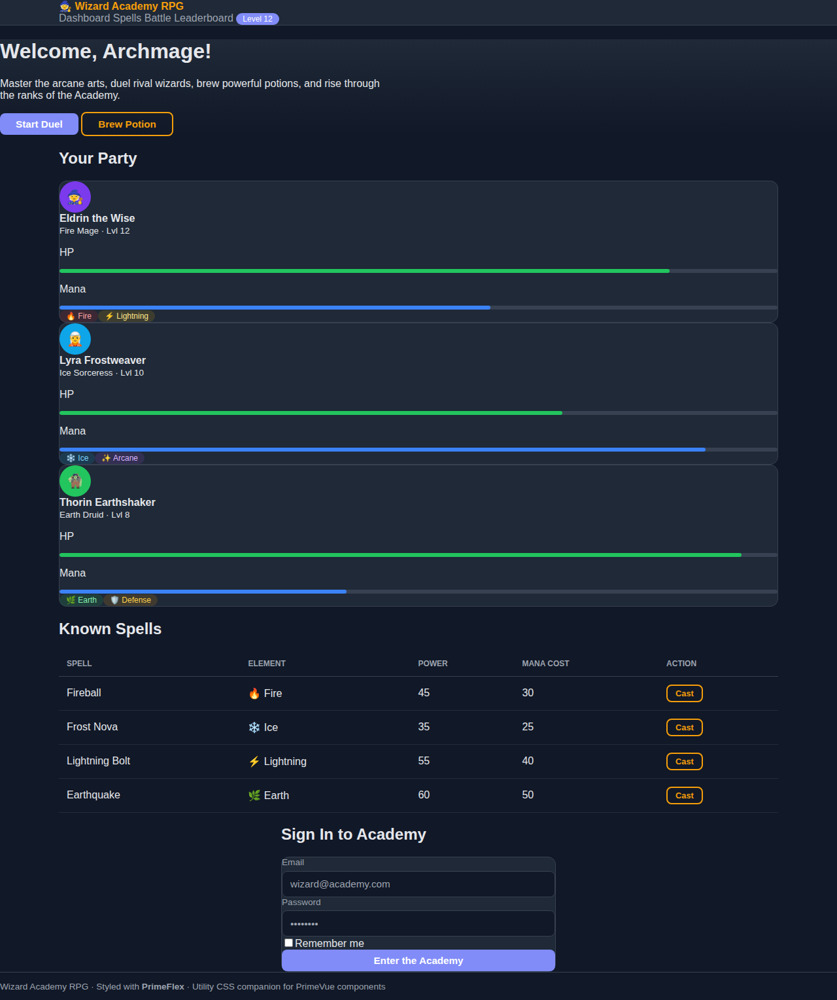

**What it is:** PrimeFlex is a utility CSS library; PrimeVue is a comprehensive Vue 3 component library.

| Pros | Cons |
|------|------|
| **Most complete Vue 3 component library** | Heavier bundle (~30 KB+ for components) |
| 90+ components (DataTable, Dialog, Charts, etc.) | PrimeFlex utility classes are less intuitive than Tailwind |
| Built-in themes including dark modes | Can feel "enterprise-y" for a game |
| Accessibility built into components | Migration from Tailwind requires effort |
| Professional quality | Some advanced components need license |

**Best for:** Feature-rich applications needing many pre-built components (modals, data tables, charts).

**Vue 3 support:** [PrimeVue](https://primevue.org/) — native Vue 3 component library.

---

### 12. Fantasy Custom Theme
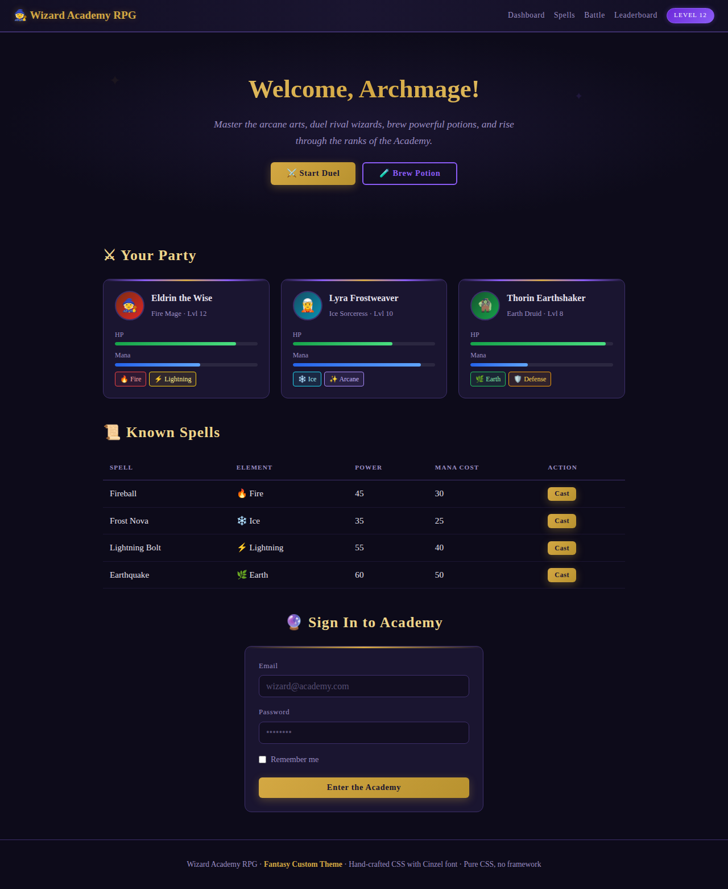

**What it is:** A hand-crafted CSS theme using Cinzel/Crimson Text fonts with fantasy RPG styling.

| Pros | Cons |
|------|------|
| **Unique, immersive RPG aesthetic** | High maintenance (all custom CSS) |
| Full creative control | No community/ecosystem |
| Gold gradients, glowing effects, fantasy fonts | Requires design skills |
| Perfect for a wizard RPG game | More CSS to maintain |
| No framework dependencies | Need to build all components from scratch |

**Best for:** A polished, production RPG game where a unique look is the priority.

---

## Recommendations

### 🥇 Top Pick: DaisyUI (on Tailwind CSS)
**Why:** Easiest migration from the current Tailwind setup. Just add `daisyui` as a Tailwind plugin and start using semantic component classes (`btn`, `card`, `badge`, `progress`, `table`). The "night" theme is dark-mode ready and looks great for an RPG. We keep all existing Tailwind utility classes while gaining beautiful pre-built components.

### 🥈 Runner-Up: Fantasy Custom Theme + Tailwind
**Why:** For maximum RPG immersion, combine Tailwind's utility classes with a hand-crafted fantasy theme (Cinzel fonts, gold gradients, glowing effects). More work, but the result is uniquely suited to a wizard game. Consider using Open Props for consistent design tokens.

### 🥉 Honourable Mention: NES.css
**Why:** If the game embraces a retro aesthetic, NES.css creates an instantly recognisable 8-bit RPG look. Fun and unique, but may limit the design as the game grows.

### For Maximum Component Coverage: PrimeVue
**Why:** If we need many pre-built interactive components (data tables, charts, dialogs, menus), PrimeVue offers the most complete Vue 3 component library with good theming.

---

## Migration Effort from Current Tailwind Setup

| Framework | Effort | Notes |
|-----------|--------|-------|
| DaisyUI | 🟢 Low | Just add plugin, start using component classes alongside existing Tailwind |
| Fantasy Custom | 🟡 Medium | Add custom CSS/fonts on top of existing Tailwind |
| NES.css | 🟡 Medium | Replace Tailwind classes with NES.css classes |
| Bootstrap 5 | 🔴 High | Full rewrite of all component markup |
| PrimeVue | 🔴 High | Replace HTML with PrimeVue components |
| Shoelace | 🔴 High | Replace HTML with Web Components |

---

## How to Run the Comparison Screenshots

```bash
cd frontend
npx playwright test e2e/css-comparison.spec.ts
```

Screenshots are saved to `docs/css-comparison/screenshots/`.
Individual HTML files in `docs/css-comparison/` can be opened in a browser to interact with each framework.

---

*Generated with Playwright screenshot tests. Each HTML file loads framework CSS via CDN for a fair side-by-side comparison.*
